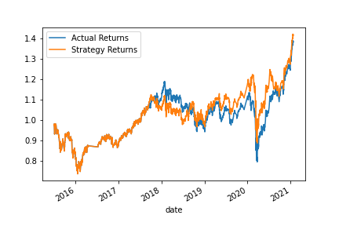
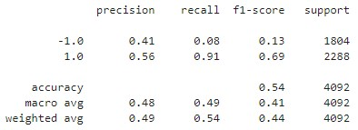
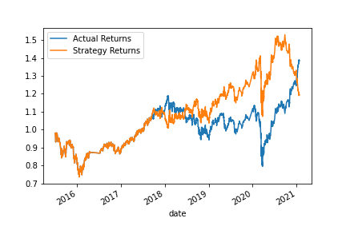
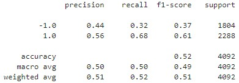

# module_14_challege

## Summary Evaluation:

An analysis of the 2 models, SVM and Linear Regression, shows the SVM output as the most appropriate model.

The SVM model, tends to perform in-line or even better than the baseline scenario. 

The recall for SVM model predicting buy scenarios is high at **.91**. However, the sell scenario only had a recall of **0.08**. 

While the LR model, proved to be more volatile. At times it showed greater gains but also underperformed the baseline scenario at other times.

### Baseline Scenario - SVM Model

The SVM model predicted buy scenarios well in the SVM model, but did a poor job of predicting and capitalizing on the sell positions. 

The steeper declines and a recall of **.08** confirm the model poorly predicted the sell positions.

The model benefits from the majority of signals being buy signals. As a result, it correctly predicted more of the buy positions.

---

---

### Linear Regression Model

The linear model predicted sell scenarios better than the SVM model, but did a worse job of predicting and capitalizing on the buy positions based on recall figures. 

The model underperforms the Actual Returns in most sell positions but does tend to outperform during the buy position.

If I had a desire to capitalize on buy scenarios this is the model I would use. It is a more volatile strategy and may underperform at times, but will overperform in good markets.

---

---